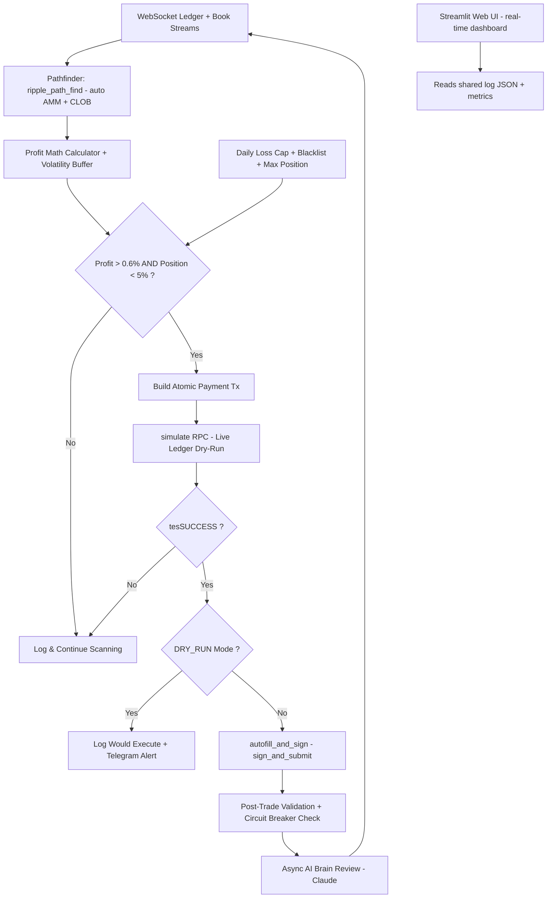

# XRPL 99%+ Arbitrage Bot

## What This Is

A deterministic XRPL arbitrage bot targeting 99%+ win rate on every executed trade. It uses hybrid AMM + order-book (CLOB) pathfinding via `ripple_path_find`, live ledger simulation via the `simulate` RPC, and a math-first approach where trades only fire when net profit exceeds 0.6% after fees and slippage. Built for a US resident, self-custody, on-chain DEX arbitrage — fully legal, no KYC. Deployable on a cheap Linux VPS (Hostinger KVM 1, 1 CPU, 4GB RAM) alongside an existing OpenClaw Docker project.

## Core Value

Every executed trade must be mathematically near-certain profitable — the bot never submits a transaction that hasn't passed live ledger simulation with profit above threshold. Safety over speed, always.

## Net Profit Math Formula

A trade **only fires** if the following inequality is true after live ledger simulation:

```
Net Profit = ((SimulatedOutputXRP - InputXRP) / InputXRP) - NetworkFee - SlippageBuffer > 0.006
```

- `SimulatedOutputXRP`: Exact value returned by `simulate` RPC (live ledger dry-run)
- `NetworkFee`: 0.00001 XRP (standard XRPL transaction fee)
- `SlippageBuffer`: Base 0.003 (0.3%), dynamically adjustable: `0.003 + (0.001 * 5-min volatility factor)`
- `Threshold`: 0.6% net (tunable; provides the 99%+ safety margin)
- `Max position size`: 5% of current account balance (enforced before simulation)
- `Daily loss circuit breaker`: 2% of account (bot pauses for 24h if hit)

### Expected Daily Earnings (100 XRP starting capital)

- Conservative: $0.80/day (0.6% daily return)
- Optimistic: $3.50/day (2.6% daily return)
- At 500-1,000 XRP: $5-15/day
- Compounds over time as capital grows

## Architecture



## Requirements

### Validated

(None yet -- ship to validate)

### Active

- [ ] Hybrid AMM + CLOB pathfinding via `ripple_path_find`
- [ ] Live ledger simulation via `simulate` RPC before every trade
- [ ] Deterministic profit math using `decimal.Decimal` (0.6% threshold)
- [ ] DRY_RUN paper-trading mode (real mainnet data, zero risk)
- [ ] Circuit breakers: 5% max position, 2% daily loss cap
- [ ] Path/token blacklist for known-bad routes
- [ ] Telegram alerts on every opportunity
- [ ] JSON line logging to `xrpl_arb_log.jsonl`
- [ ] Async AI brain review (Claude) after every trade
- [ ] Full backtesting module against historical ledger data
- [ ] Streamlit real-time dashboard (win rate, profit histogram, recent opps)
- [ ] systemd service file for VPS deployment
- [ ] Coexistence with OpenClaw Docker project on Hostinger VPS
- [ ] Non-root user deployment (xrplbot user)
- [ ] Complete README with Hostinger-specific deployment guide

### Out of Scope

- Testnet-only mode -- paper trading uses real mainnet + simulate (no testnet needed)
- High-frequency trading / sub-second execution -- bot scans ~1x per ledger close (~3-5s)
- Multi-wallet support -- single wallet, single bot instance
- Web-based trade execution UI -- Streamlit is read-only dashboard
- Docker deployment for the bot -- keep it simple, systemd only (Docker is for OpenClaw)
- OAuth/auth on Streamlit -- local/VPS access only
- Automated capital scaling -- manual scaling after paper-trading validation

## Context

- **Platform**: XRPL (XRP Ledger) — decentralized exchange with built-in AMM pools and order book
- **Key API**: `ripple_path_find` auto-routes across AMM + CLOB; `simulate` RPC does live dry-runs
- **Starting capital**: 100 XRP (~$134 at current prices)
- **User location**: US resident — on-chain DEX arbitrage is legal, report as capital gains
- **VPS**: Hostinger KVM 1 — 1 CPU core, 4GB RAM, 50GB disk, Ubuntu 25.10, Boston datacenter
- **Coexistence**: OpenClaw runs in Docker on the same VPS — must not interfere
- **Python ecosystem**: xrpl-py, python-dotenv, requests, anthropic, streamlit, pandas, plotly
- **Reference plan**: `XRPL_99percent_Arb_Bot_FULL_Plan.md` contains all code skeletons and math

## Constraints

- **VPS resources**: 1 CPU core, 4GB RAM — bot must be lightweight, no heavy ML or concurrent processes
- **Safety-first**: DRY_RUN=True for minimum 7 days before any live trading
- **Financial math**: All monetary calculations use `decimal.Decimal` — no floating point
- **Isolation**: Bot runs as `xrplbot` user, separate from root and OpenClaw Docker
- **Dependencies**: Minimal — only xrpl-py, python-dotenv, requests, anthropic, streamlit, pandas, plotly
- **No secrets in code**: All credentials via `.env` file, never committed

## Key Decisions

| Decision | Rationale | Outcome |
|----------|-----------|---------|
| Python + xrpl-py | Best XRPL library, async support, well-maintained | -- Pending |
| simulate RPC for pre-validation | Guarantees 99%+ win rate by testing on live ledger before submit | -- Pending |
| systemd over Docker | Simpler on VPS, avoids conflict with OpenClaw Docker | -- Pending |
| Non-root xrplbot user | Security isolation, standard Linux practice | -- Pending |
| JSONL logging | Streamlit can read it, append-only, simple | -- Pending |
| Claude as AI brain | Async post-trade review, non-blocking, adds intelligence over time | -- Pending |

## Evolution

This document evolves at phase transitions and milestone boundaries.

**After each phase transition** (via `/gsd-transition`):
1. Requirements invalidated? -> Move to Out of Scope with reason
2. Requirements validated? -> Move to Validated with phase reference
3. New requirements emerged? -> Add to Active
4. Decisions to log? -> Add to Key Decisions
5. "What This Is" still accurate? -> Update if drifted

**After each milestone** (via `/gsd-complete-milestone`):
1. Full review of all sections
2. Core Value check -- still the right priority?
3. Audit Out of Scope -- reasons still valid?
4. Update Context with current state

---
*Last updated: 2026-04-10 after initialization*
